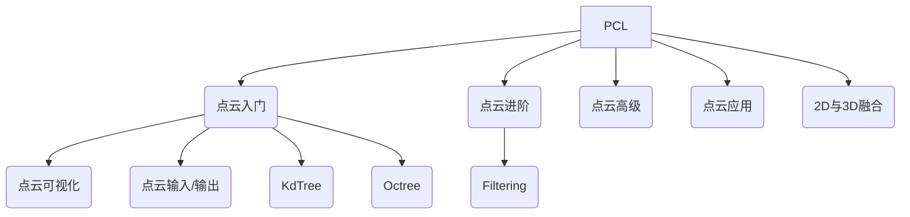

# 资源汇总

- [黑马机器人](http://robot.czxy.com/docs/pcl/chapter02/filtering/)
- [官方教学](https://pcl.readthedocs.io/projects/tutorials/en/latest/#applications)

- [github地址](https://github.com/PointCloudLibrary/pcl/tree/master/test)

主干还是以黑马机器人学习为主，然后辅以其他两个教学。


# 文档教学大纲




# 点云入门

## 简单介绍

点云定义：表达目标空间分布和目标表面特性的点的集合，既可以从设备中获取，也可以从CAD中绘制得到。

三维图一般分为：深度图（描述物体与相机的距离信息），几何模型（由CAD等软件生成），点云模型（逆向工程设备采集生成）


## 配置cmakelist文档

```cmake
cmake_minimum_required(VERSION 3.14)
project(PCLDemo)
set(CMAKE_CXX_STANDARD 14)

# 设置输出根目录为build/Debug
set(OUTPUT_DIRECTORY_ROOT ${CMAKE_CURRENT_SOURCE_DIR}/build/${CMAKE_BUILD_TYPE})
# 设置可执行程序输出到build/Debug/bin目录
set(CMAKE_RUNTIME_OUTPUT_DIRECTORY "${OUTPUT_DIRECTORY_ROOT}/bin" CACHE PATH "Runtime directory" FORCE)
# 设置库文件输出到build/Debug/lib目录
set(CMAKE_LIBRARY_OUTPUT_DIRECTORY "${OUTPUT_DIRECTORY_ROOT}/lib" CACHE PATH "Library directory" FORCE)
set(CMAKE_ARCHIVE_OUTPUT_DIRECTORY "${OUTPUT_DIRECTORY_ROOT}/lib" CACHE PATH "Archive directory" FORCE)

find_package(PCL REQUIRED)
# 包含头文件目录
include_directories(${PCL_INCLUDE_DIRS})
# 设置依赖库链接目录
link_directories(${PCL_LIBRARY_DIRS})
# 添加预处理器和编译器标记
add_definitions(${PCL_DEFINITIONS})

add_executable(PCLDemo main.cpp)
target_link_libraries(PCLDemo ${PCL_LIBRARIES})
```


## 数据结构

PCL的基本数据类型是`PointCloud`，一个`PointCloud`是一个C++的模板类，它包含了以下字段：

- `width(int)`：指定点云数据集的宽度
  - 对于无组织格式的数据集，width代表了所有点的总数
  - 对于有组织格式的数据集，width代表了一行中的总点数
- `height(int):`制定点云数据集的高度
  - 对于无组织格式的数据集，值为1
  - 对于有组织格式的数据集，表示总行数
- `points(std::vector<PointT>)`：包含所有PointT类型的点的数据列表

PoinT对应的数据类型有：

- **PointXYZ** - float x, y, z
- **PointXYZI** - float x, y, z, intensity
- **PointXYZRGB** - float x, y, z, rgb
- **PointXYZRGBA** - float x, y, z, uint32_t rgba
- **Normal** - float normal[3], curvature 法线方向，对应的曲率的测量值
- **PointNormal** - float x, y, z, normal[3], curvature 采样点，法线和曲率
- **Histogram** - float histogram[N] 用于存储一般用途的n维直方图


## 数据的旋转

这是一个变换矩阵，由旋转矩阵和平移矩阵组成

```c++
/* Reminder: how transformation matrices work :

             |-------> This column is the translation
      | 1 0 0 x |  \
      | 0 1 0 y |   }-> The identity 3x3 matrix (no rotation) on the left
      | 0 0 1 z |  /
      | 0 0 0 1 |    -> We do not use this line (and it has to stay 0,0,0,1)

      METHOD #1: Using a Matrix4f
      This is the "manual" method, perfect to understand but error prone !
    */
    Eigen::Matrix4f transform_1 = Eigen::Matrix4f::Identity();

    // Define a rotation matrix (see https://en.wikipedia.org/wiki/Rotation_matrix)
    float theta = M_PI / 4; // The angle of rotation in radians
    transform_1(0, 0) = cos(theta);
    transform_1(0, 1) = -sin(theta);
    transform_1(1, 0) = sin(theta);
    transform_1(1, 1) = cos(theta);
    //    (row, column)

    // Define a translation of 2.5 meters on the x axis.
    transform_1(0, 3) = 2.5;

    // Print the transformation
    printf("Method #1: using a Matrix4f\n");
    std::cout << transform_1 << std::endl;     
```

这是第二中旋转矩阵的方法。

```c++
// 创建仿射变换对象
Eigen::Affine3f transform_2 = Eigen::Affine3f::Identity();
// 在x轴平移0.8m
transform_2.translation() << 0.8, 0.0, 0.0;
// 绕Z轴先转45度（逆时针）
transform_2.rotate(Eigen::AngleAxisf(M_PI / 4;, Eigen::Vector3f::UnitZ()));
// 打印仿射变换矩阵
printf("\nMethod #2: using an Affine3f\n");
std::cout << transform_2.matrix() << std::endl;
// 创建变换后的点云
pcl::PointCloud<pcl::PointXYZ>::Ptr transformed_cloud(new pcl::PointCloud<pcl::PointXYZ>());

// 执行变换， source_cloud为变换前的点云
pcl::transformPointCloud(*source_cloud, *transformed_cloud, transform_2);
```


 后面基本按照书上顺序学习。